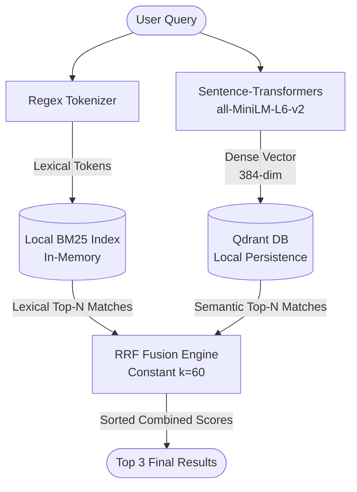

# Space Books Hybrid Search Engine

A high-performance, persistent local hybrid search engine combining sparse keyword retrieval (BM25) and dense semantic vector retrieval (Cosine similarity on transformer embeddings) with Reciprocal Rank Fusion (RRF).

---

## Project Architecture Overview

The search engine processes query inputs via two concurrent pathways to balance lexical precision and semantic comprehension:



1. **Lexical Path (BM25)**: Tokenizes the raw query and scores the corpus based on term frequency-inverse document frequency adjustments. Excellent for exact token matches, proper nouns (e.g., "NASA", "ISRO"), and serial identifiers.
2. **Semantic Path (Qdrant)**: Embeds the query into a 384-dimensional space and queries the local vector database using cosine distance metrics. Excellent for capturing conceptual synonyms and intent (e.g., mapping "water" to "geysers of water vapor" or "liquid water beneath the surface").
3. **Fusion Layer (RRF)**: Merges the ranked outputs from both streams, mitigating the scoring scale disparity between BM25 (arbitrary positive real numbers) and Qdrant cosine distance (normalized range `[-1, 1]` or `[0, 1]`).

---

## Core Tech Stack

- **Python (v3.14.3)**: Main runtime engine.
- **Qdrant (v1.18.0)**: Used in Local Storage Mode (SQLite-like disk persistence to `qdrant_db/`), providing fast vector indexing and querying without the overhead of containerization.
- **Rank-BM25 (v0.2.2)**: Pure-Python implementation of the Okapi BM25 algorithm used to construct the lexical index on the database corpus.
- **Sentence-Transformers (v5.5.1)**: Utilizes the `all-MiniLM-L6-v2` model, a lightweight, free model mapping sentences/paragraphs to a 384-dimensional dense vector space.

---

## How Reciprocal Rank Fusion (RRF) Works

Reciprocal Rank Fusion is a model-agnostic rank merging method. Standard score normalization methods fail when score distributions from different search systems differ wildly. RRF sidesteps scores entirely by using the relative ranks of documents.

The RRF score for a document $d \in D$ is defined as:

$$RRF\_Score(d) = \sum_{m \in M} \frac{1}{k + r_m(d)}$$

Where:
- $M$ is the set of retrieval systems (in this project, $M = \{\text{BM25}, \text{Semantic}\}$).
- $r_m(d)$ is the rank of document $d$ in retrieval system $m$ (1-based index). If a document does not appear in the top results of system $m$, its reciprocal rank term for that system is $0$.
- $k$ is a smoothing constant that prevents high-ranking documents from overly dominating the results. By standard heuristic conventions, this is set to $k = 60$.

---

## Live Verification Demo Output

Below is the execution log from running a live hybrid query (`"Roscosmos Saturn water"`) on the fully-populated index:

```text
=========================================
Hybrid Search Query: 'Roscosmos Saturn water'
=========================================

--- Top 3 Keyword (BM25) Matches ---
1. [ID 863] Roscosmos Studies geysers of water vapor via radiation-hardened electronics (Score: 5.38)
2. [ID 265] ISRO Studies geysers of water vapor via infrared cameras (Score: 5.34)
3. [ID 249] NASA Studies geysers of water vapor via deep-space communication arrays (Score: 4.91)

--- Top 3 Semantic (Qdrant) Matches ---
1. [ID 188] Cassini-Huygens - Mission to the Sun (Score: 0.6122)
2. [ID 863] Roscosmos Studies geysers of water vapor via radiation-hardened electronics (Score: 0.6104)
3. [ID 888] Roscosmos Studies unusual mineral deposits via miniaturized instruments (Score: 0.6084)

--- Top 3 Combined (RRF Hybrid) Matches ---

1. [ID 863] Roscosmos Studies geysers of water vapor via radiation-hardened electronics (RRF Score: 0.03252)
   BM25 Rank: Rank 1 | Semantic Rank: Rank 2
   Excerpt: Advances in infrared cameras are transforming missions to Saturn. A new ESA prototype reduced mass while improving performance, first tested on OSIRIS...

2. [ID 249] NASA Studies geysers of water vapor via deep-space communication arrays (RRF Score: 0.03080)
   BM25 Rank: Rank 3 | Semantic Rank: Rank 7
   Excerpt: Roscosmos and SpaceX have partnered to develop a joint mission to Saturn. The collaboration combines expertise in heat shields with interest in signs ...

3. [ID 265] ISRO Studies geysers of water vapor via infrared cameras (RRF Score: 0.02946)
   BM25 Rank: Rank 2 | Semantic Rank: Rank 15
   Excerpt: The Mars Perseverance mission has measured liquid water beneath the surface on Saturn during its primary mission phase. Scientists at Roscosmos are an...
```

---

## Interactive Streamlit Web Interface

An interactive, custom-styled Streamlit UI is provided in `app.py`. It features:
- A clean, centralized search query input.
- Elegant glassmorphic cards displaying the top 3 merged hybrid matches.
- Detailed metrics badges rendering the combined RRF score alongside individual lexical and semantic ranks.

To run the Streamlit application:
```bash
streamlit run app.py
```

